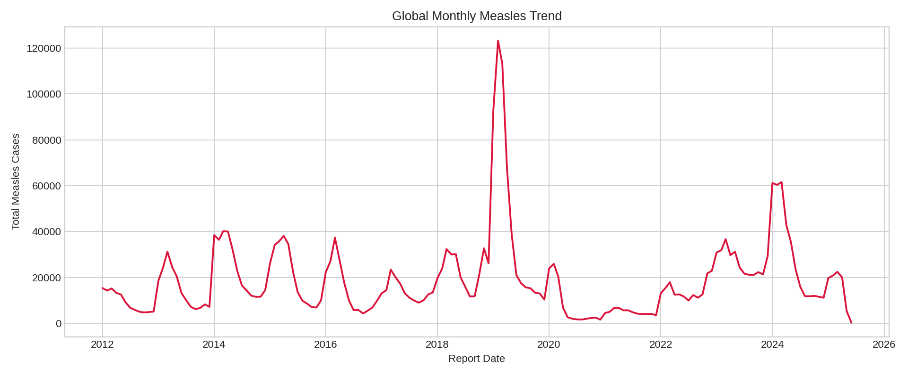
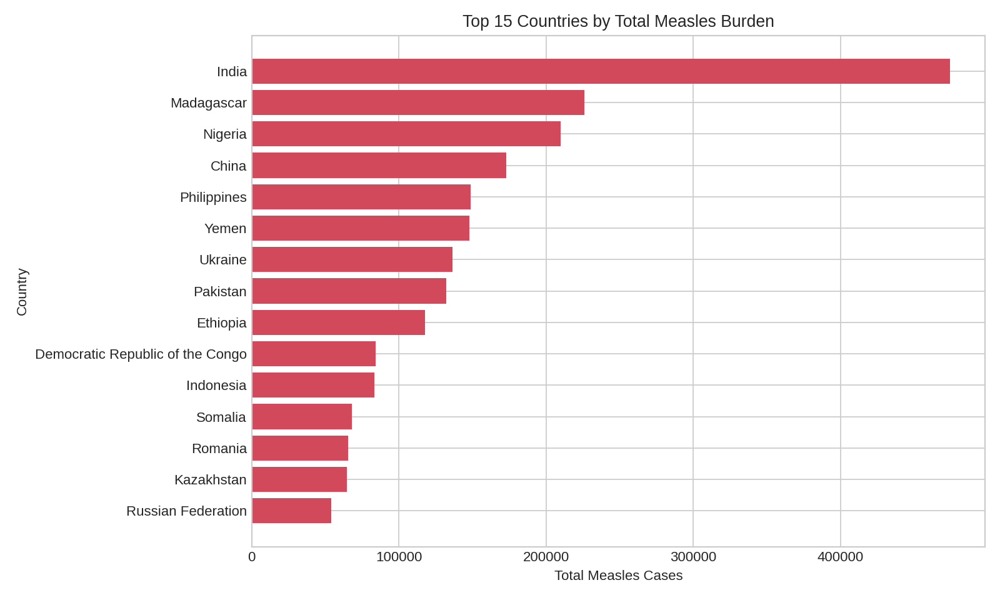
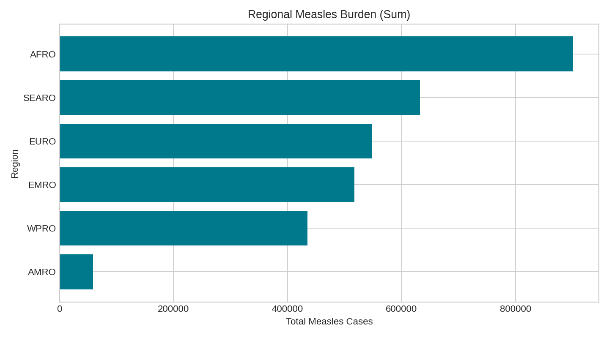
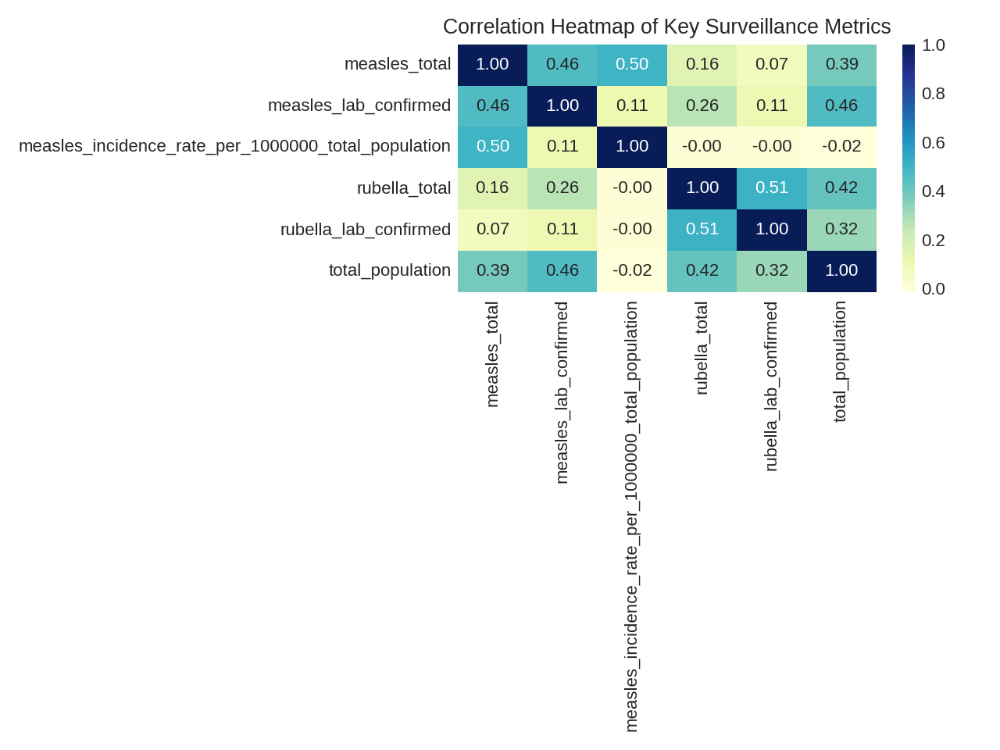

# Final Report v1: Global Measles and Rubella Surveillance Analysis

Author: Brenda  
Project: TidyTuesday Measles Analysis  
Date: 2026-03-28  
Status: Auto-filled draft

## Executive Summary
This report analyzes global measles and rubella surveillance trends using monthly and yearly datasets. The workflow includes data cleaning, validation, exploratory analysis, and visual storytelling. The monthly dataset spans 22,780 records from 2012-01-01 to 2025-06-01, while the yearly dataset contains 2,382 records with no duplicate rows detected. Regional burden is highly uneven, with AFRO contributing the largest cumulative measles load (901,018 cases), and India contributing the highest country-level cumulative burden (474,525 cases). Yearly global measles totals peak in 2019 (541,401 cases) and decline to a low in 2021 (59,619 cases), indicating substantial temporal fluctuation. Data quality checks show focused missingness in selected yearly indicators (87 missing total suspected values and 408 missing discarded-rate values), with zero rows missing surveillance breakdown fields and 13 records violating the expected suspected-vs-total consistency rule.

## Objectives
1. Profile global measles and rubella burden across countries and regions.
2. Create clean, analysis-ready datasets from raw surveillance files.
3. Summarize key temporal and geographic trends with reproducible visuals.

## Data Sources
- Raw monthly data: ../data/cases_month.csv
- Cleaned monthly data: ../data/cases_month_clean.csv
- Raw yearly data: ../data/cases_year.csv
- Notebook workflows:
  - ../notebooks/monthly_measles.ipynb
  - ../notebooks/yearly_measles.ipynb

## Methods
### Data Preparation
- Standardized and validated column structure.
- Converted fields to numeric/date types where appropriate.
- Checked for invalid and negative surveillance values.
- Removed duplicates and tracked missingness.
- Created helper fields for analysis readiness (for example: report_date and yearly surveillance flags).

### Exploratory Analysis
- Missingness and data-quality profiling.
- Distribution summaries for major surveillance counts.
- Regional burden and country ranking analysis.
- Monthly and yearly trend analysis.
- Correlation exploration for key epidemiological metrics.

## Results
### Data Quality Findings
- Monthly cleaning output was successfully generated and saved.
- Row counts: 22,780 monthly raw rows, 22,780 monthly cleaned rows, and 2,382 yearly rows.
- Duplicate rows removed during this reporting run: 0 (monthly raw), 0 (monthly clean), 0 (yearly).
- Missing values are concentrated in yearly aggregate fields:
  - `total_suspected_measles_rubella_cases`: 87 missing rows.
  - `discarded_non_measles_rubella_cases_per_100000_total_population`: 408 missing rows.
- Validation checks:
  - Rows missing surveillance breakdown fields: 0.
  - Rows with measles but missing measles breakdown: 0.
  - Rows where suspected cases are below measles+rubella totals: 13.

### Key Findings
1. AFR is the highest-burden region for measles in this dataset, with 901,018 cumulative cases.
2. India has the highest country-level cumulative measles burden, with 474,525 total reported cases.
3. Global yearly measles burden varies strongly over time, peaking in 2019 (541,401) and dropping to a local minimum in 2021 (59,619), while core surveillance breakdown fields remain structurally complete (0 missing rows across the breakdown flag definition).

### Regional Patterns
Regional burden is concentrated in a subset of WHO regions, with AFR contributing the largest cumulative measles total in the analyzed period. The region-level summary table (`table_02_region_summary.csv`) shows clear separation between high-burden and lower-burden regions, indicating that surveillance and control priorities are not uniformly distributed.

### Temporal Patterns
The monthly global trend (Figure 1) spans 2012-01 through 2025-06 and shows pronounced fluctuations over time. At yearly resolution (Table 3), measles totals rise to their highest observed level in 2019 and then drop sharply by 2021, consistent with a non-linear burden trajectory rather than a steady trend.

## Figures
Save exported charts to ../outputs/figures and replace placeholders below.

### Figure 1. Global monthly measles trend

### Figure 2. Top countries by total measles burden

### Figure 3. Regional burden comparison

### Figure 4. Correlation heatmap

## Tables
Save exported tables to ../outputs/tables and link here.

- Table 1: ../outputs/tables/table_01_data_quality_summary.csv
- Table 2: ../outputs/tables/table_02_region_summary.csv
- Table 3: ../outputs/tables/table_03_yearly_trend.csv
- Table 4: ../outputs/tables/table_04_top_countries_measles.csv

## Limitations
- Surveillance completeness and reporting quality vary by country and period.
- Missing values can affect direct cross-country comparisons.
- Aggregated indicators may hide subnational differences.

## Conclusion
This analysis provides a reproducible overview of measles and rubella surveillance patterns and highlights substantial variation across regions, countries, and years. AFRO emerges as the top-burden region and India as the highest-burden country in cumulative measles totals. Temporal analysis shows a strong global peak in 2019 followed by a marked decline in 2021, reinforcing the importance of trend-aware interpretation rather than single-year comparisons. The generated figures and tables in `outputs/` provide a complete evidence base for this draft and can be used directly in presentation or policy-oriented summaries.

## Reproducibility
1. Activate environment and install dependencies from ../requirements.txt.
2. Run notebooks end-to-end:
   - ../notebooks/monthly_measles.ipynb
   - ../notebooks/yearly_measles.ipynb
3. Export figures to ../outputs/figures and tables to ../outputs/tables.
4. Re-run summary generation if source data changes.

## Appendix Checklist
- [x] Executive summary updated with final numbers.
- [x] All figure links resolve.
- [x] All table links resolve.
- [x] Key claims are supported by a figure/table.
- [x] Date and author information updated.
